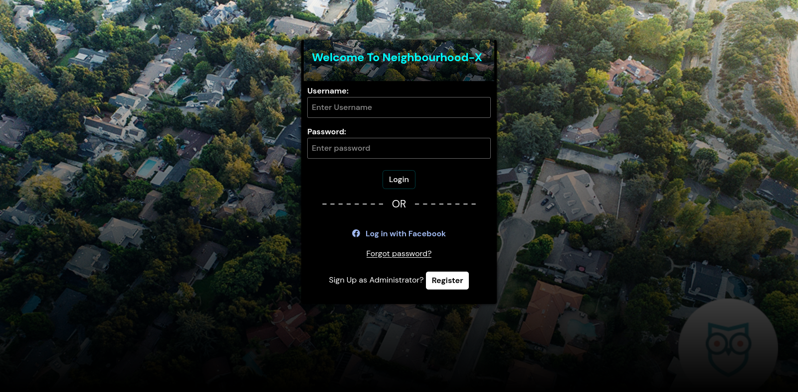

# NeighbourhoodX

## Description
This is a web application that allows you to be in the loop about everything happening in your neighborhood. You can check businesses around, You can view messages from other residents, You can add a business. You can check for Social services centers around e.g Hospital and many more.

- * Before you get access to the platform you have to be added to the database by your neighbourhood administrator. *

## Future Plans

- Restrict neighbourhood radius to make it more effective.

## Preview
### Login view

### Administrator Dashboard
- Get details by Clicking on markers

### As an administrator, you get to:
- You can add residents to the neighbourhood map(click to get latitude and longitude first and add resident's home location accordingly) - The login credentials will be - - auto-generated and sent to the added resident through the Email entered
- You can add social services to the neighbourhood map.
- You can send alerts to the residents and delete any malicious post.

## Author
- LYONS ALBERT
- Email: lyonsmasawa@gmail.com