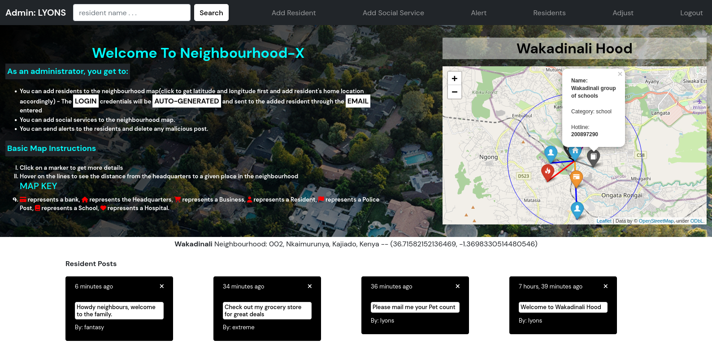

# NeighbourhoodX
## Description
This is a web application that allows you to be in the loop about everything happening in your neighborhood. You can check businesses around, You can view messages from other residents, You can add a business. You can check for Social services centers around e.g Hospital and many more.

### As an administrator, you get to:
- You can add residents to the neighbourhood map.
- You can add social services to the neighbourhood map.
- You can send alerts to the residents and delete any malicious post.
- You can edit neighbourhood details.

## Administrator Manual
### Register view
- Enter your respective details
- click on Administrator set up and check your email for instructions

### Set Up Neighbourhood
- Enter neighbourhood Name
- mark a Location on the map where you want your headquarters to be.
  

### Administrator Dashboard
- Get details by Clicking on markers
  

### Add Resident
- click on Add Resident in the navigation bar
- The login credentials will be auto-generated and sent to the added resident through the EMAIL entered so ensure it is REAL and the CORRECT email address of the resident.
- Please add Resident location to map accordingly(click to get latitude and longitude first and add resident's home location accordingly)
  

### Add Social Service
- click on Add Social Service Center in the navigation bar
  

### Adjust Neighbourhood Details
- click on Adjust in the navigation bar
  

### View Residents
- click on view residents in the navigation bar
  

### Delete resident
- Delete Resident by clicking on the times icon in the view residents page
  

### Delete Post
- Delete a Post by clicking on the times icon on the specific post card
  
  
## Author
- LYONS ALBERT
- Email: lyonsmasawa@gmail.com